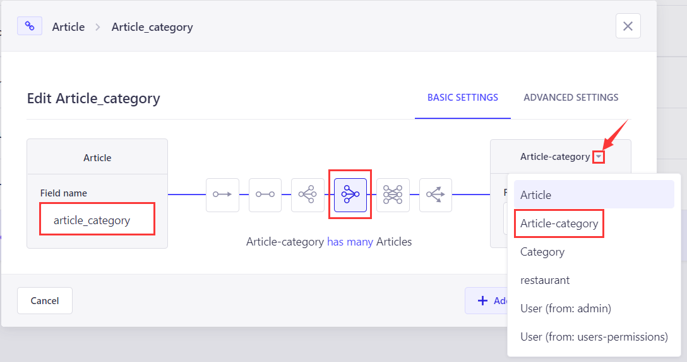

# STRAPI user guide

Author: Guanlin Li

E-mail: lig11@rpi.edu

Environment: Windows 10 10.0.19044

---

1. Installation
   
    * Prerequisite

        * Node.js

            Strapi required Node.js to be installed on the machine. The download link can be found [here](https://nodejs.org/en/download/). Choose the  Windows Installer (.msi) 64-bit one and download. Once download is finished, start installing following the installation guidance. Don't forget to add Node.js to your *PATH*. After installation is complete, open a command prompt window and type `node -v` which should gives you the latest version of Node.js. Then, type `npm -v` which should also gives you the latest version of npm. If any of them prints an error message, try reboot your computer and reinstall the Node.js. 

        * Yarn

            Yarn will help us to configure and run Strapi on Windows. The download link can be found [here](https://classic.yarnpkg.com/latest.msi). Once download is finished, start installing the software. The installation should automatically add yarn to *PATH*. After the installation is finished, open a command prompt and type `yarn -v`. You should see the latest version of yarn, indicating that yarn has been successfully installed. 

            

2. Start a new project

     To start your project, open up a command prompt and go to the directory where you wishes to put your project at. Then, simply type `yarn create strapi-app YOUR_PROJECT_NAME --quickstart`. This will create a folder called *YOUR_PROJECT_NAME* under the specified directory, and all other files will be under that directory. Wait until the command prompt shows that the server is on, and you can open up the [admin page](http://localhost:1337/admin) in your browser. 

    * Solution to possible error

        If you are unable to open the [admin page](http://localhost:1337/admin), it is possible that some other programs are using the port 1337. To view which program is using the port, open a command prompt with administrator and type `netstat -aon`. This will list all programs that are currently using the localhost ports. Find port 1337 and find the PID of the program (which is the last number on that row). Open task manager and go to Details page, sort by PID and kill the specific program with the corresponding PID. In my case, the RAZER service is using the port, so I can simply kill the RAZER service. You can also change the port strapi will be using by opening up .env file and change the port to another number that will not conflict with other programs. 

3. Configure your backend
    
    now as we have created a backend, it's time for us to configure it to provide API in order to communicate with the frontend. 

    type in `http://localhost:1337/admin` or change 1337 to the port you assign to strapi, which will lead you to the admin page. Register a new account, and login with that account. You should now see the admin panel. 

4. Examples
   
   * Google account authentication 
  
        First, visit the [Google Developer Console](https://console.cloud.google.com/apis/credentials/oauthclient) to get a new OAuth Client and get the Client ID and Client secret. You should create a new OAuth client ID first, then choose "web application" as the application type, then add the following redirect URLs:

        http://localhost:1337/api/connect/google/callback

        This url might change based on the version of the strapi you are currently using. We can find the required url in later steps. 

        You should also add your front-end url at this position, but since we are focusing on Strapi, I will not mention too much about the front-end. 

        After you click the save button, you should be able to get the new OAuth Client ID and secret. Save the data file. 

        Now, go to Strapi admin page, and choose *settings* on the left side of the screen. Choose *Providers* in the *USERS & PERMISSIONS PLUGIN* section, and find *Google* among the list of providers. Click it and you should see the *edit Provider* page. You need to put the Client ID and secret in this page, and set your front-end url. You should also be able to see your back-end url here. After you finished, click save button. 

        
        

        Now the Google Auth should be able to work. 

        To view all users, go to the *Content Manager* section, and click on the *User* in the *COLLECTION TYPE* section. 
        
        

    * Blog page building

        First, go to Content-Type Builder on the left side of the panel. Click *Create  new collection type* under section *COLLECTION TYPES*, and write `article-category` in *Display name* section. Click continue, then add:
        
        * Text (**used as the name of the categories of the articles**, choose short text type and select *required field* in *ADVANCED SETTINGS*)

        After you finished, click save on the up-right corner. 
        
        Now we build the category type, we can start building the main article type.Click *Create new collection type* under section *COLLECTION TYPES*, and write `article` in *Display name* section. Click continue, then add:
        * Text (Name = title, Type = short text, select *required field* in *ADVANCED SETTINGS*)
        * Rich text (Name = content, select *required field* in *ADVANCED SETTINGS*)
        * Date (Name = publish_time, Type = datetime (ex: 01/01/2022 00:00 AM), select *required field* in *ADVANCED SETTINGS*)
        * Media (Name = img, Type = Single Media, select *required field* in *ADVANCED SETTINGS*)
        * Relation (Name = article_category, select *has many*, select right side collection name as *article-category*, see following image)

        After you finished, click save on the up-right corner.

        Now, the structures of the article is set, and we can move forward to build our first article. move to the *Content manager* on the left side panel, and first choose *article-category* in *COLLECTION TYPES* section. Click *Create new entry* on the up-right corner. You should be able to see a name section. Write anything for your article types. For example, you can write *Novel* for novel-type articles, or *short stories* for short stories type articles. Click save on the up-right corner, then click publish at the same position. 

        Now we have set up our article types, we can proceed to add our first article.  Choose *article* in *COLLECTION TYPES* section. Click *Create new entry* on the up-right corner. Now, you should be able to see all the collection types we build in previous steps. Write anything you wish, and don't forget that there's a classification on the right side panel under *RELATION* section. You should be able to see all the article types you added in previous steps. After you finished, click save and publish on the up-right corner. 

        Now, our first article is published. However, we still cannot view it from outside because we have not yet give permission to other users to view it. To make the article public, go to *Settings* on the left side of the panel, and choose *Roles* under **USERS & PERMISSIONS PLUGIN** section. Since there are two roles in Settings section, please make sure you choose the correct one. Then, click *Public* section, and choose *arcitle* under *Permissions* section. Select *find* and *findOne*, then click save on the up-right corner. Repeat the procedure for *article-category*. 
        
        

        Now, you should be able to view your article in json format under [http://localhost:1337/api/articles](http://localhost:5020/api/articles). 

        Congratulations! You have now published your first article. 